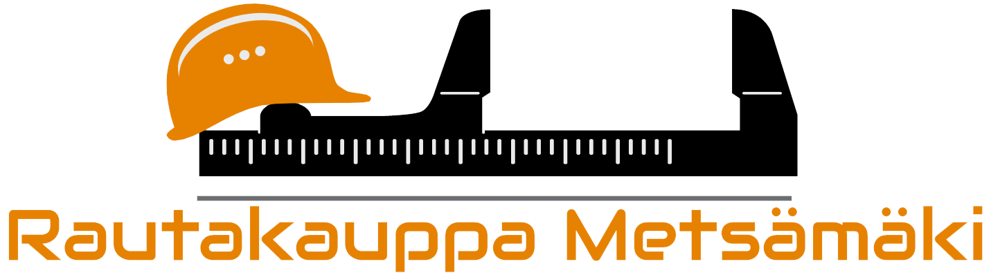

[](https://mit-license.org/)


<p align="center">
  <a href="https://github.com/hamk-ohjelmointi-intip19x6/hamk-development-team-02">
    
  </a>
  <h2 align="center">HAMK Development Team 02</h2>
  
  <p align="center">
    Rautakauppa Metsämäki tilausjärjestelmästä 🛠️
    <br />
    <a href="https://github.com/hamk-ohjelmointi-intip19x6/hamk-development-team-02/wiki"><strong>📙 Wiki</strong></a>
	|
	<a href="https://github.com/hamk-ohjelmointi-intip19x6/hamk-development-team-02/graphs/contributors"><strong>👥 Tekijät</strong></a>
    <br />
    <br />
  </p>
</p>

## Sisällysluettelo
* [Kuvaus](#kuvaus)
* [Arkiston kloonaaminen](#arkiston-kloonaaminen) 
* [Lisenssi](#lisenssi)

---

### Kuvaus
Tämän projektin tavoitteena on toteuttaa tilausjärjestelmä, jolla pystyy tekemään uusia tilauksia sekä muokata ja seurata 
tilausten etenemistä. Ohjelma toteutetaan kuvitteelliselle yritykselle. Suunnittelu sekä toteutus tapahtuu GitHubin välityksellä 
sekä tapaamisilla Hämeen ammattikorkeakoulun tiloissa. Ohjelmointikielenä toimi C -ohjelmointikieliperheeseen kuuluva C#, sekä
standardoitu relaatiotietokantojen kyselykieli SQL.

<a href="https://www.youtube.com/watch?v=7xhs9KFVZT0&feature=youtu.be"><strong>📹 Linkki videoon</strong></a>

---

### Arkiston kloonaaminen
1. Avaa Git Bash (Jos sulla ei ole asennettu Git, voi lataa sen täältä: [https://git-scm.com/downloads](https://git-scm.com/downloads))
2. Kirjoita git clone ja liitä sitten kopioimaasi URL-osoite.
```sh
git clone https://github.com/hamk-ohjelmointi-intip19x6/hamk-development-team-02.git
```

---

### Lisenssi
Lisenssi on yleistetty muoto MIT:n X11-lisenssistä. Se on intransitiivinen lisenssi, joka sallii melkein minkä vain. Ainoat rajoitukset 
liittyvät siihen, että lisenssiteksti tulee säilyttää myös muutoksia tehtäessä tai ohjelman osia kopioitaessa toisiin ohjelmiin. 
Se ei estä ohjelman omisteistamista.
